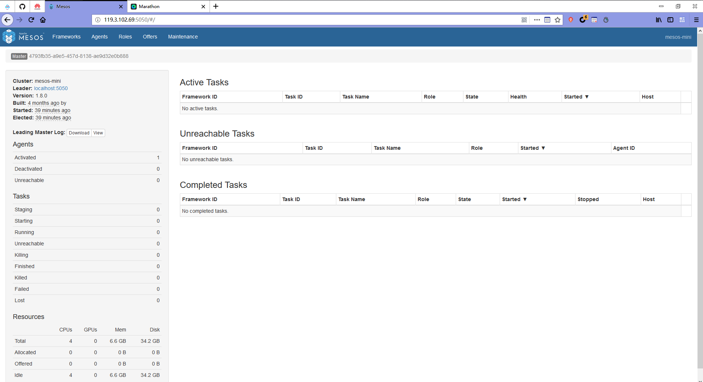
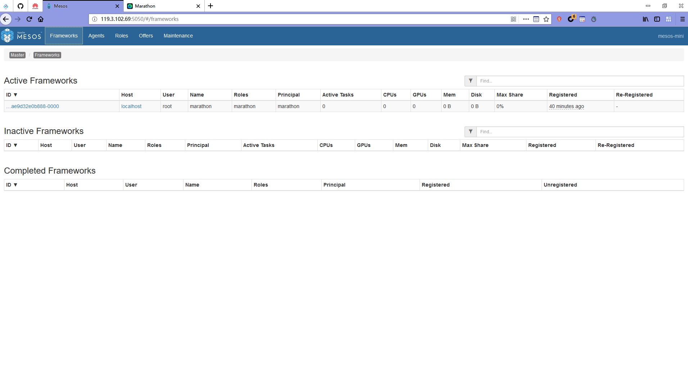
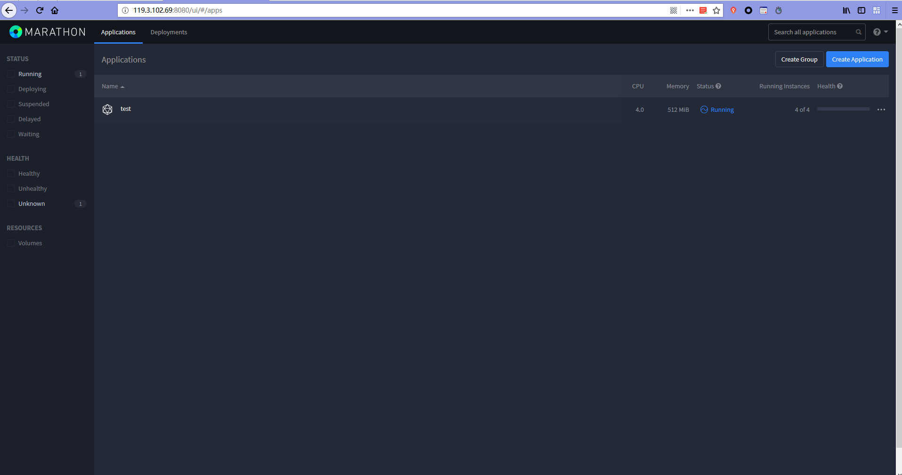
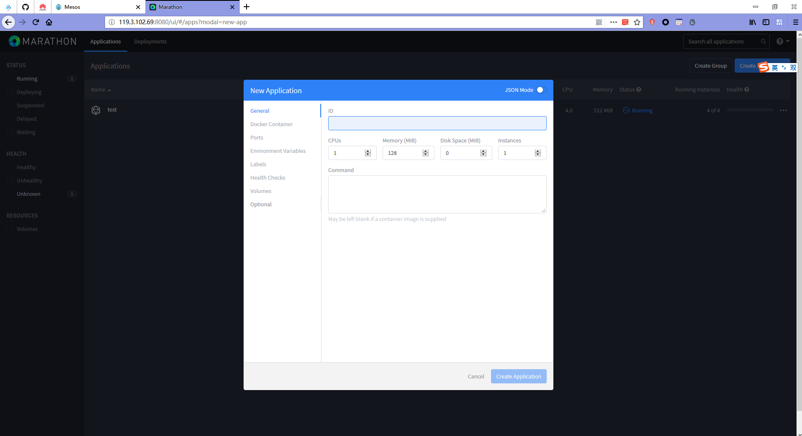

# [Mesos Mini](https://hub.docker.com/r/mesos/mesos-mini/)

## Apache mesos:
http://mesos.apache.org/blog/mesos-mini/


Run Mesos Locally with Mesos Mini Docker Container
https://medium.com/apache-mesos/run-mesos-locally-with-mesos-mini-docker-container-a87696c788f5








## Create application

### 创建应用：

```
curl -X POST -d @app.json -H "Content-type: application/json" http://localhost:8080/v2/apps
```

### 其中：App.json ：

```
{
  "id": "test",
  "cmd": "sleep 1000",
  "cpus": 1,
  "mem": 128,
  "disk": 0,
  "instances": 1,
  "container": {
    "docker": {
      "image": "alpine"
    },
    "type": "DOCKER"
  },
  "networks": [
    {
      "mode": "host"
    }
  ]
}
```


# [minimesos](https://github.com/ContainerSolutions/minimesos)


